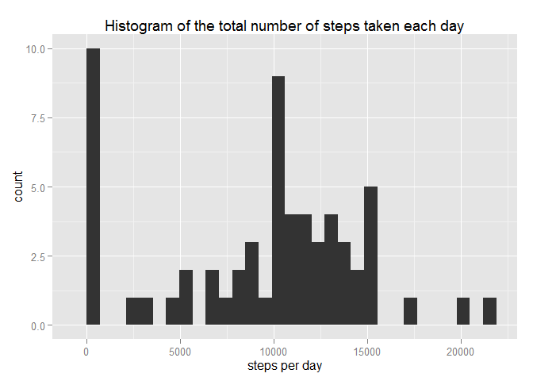
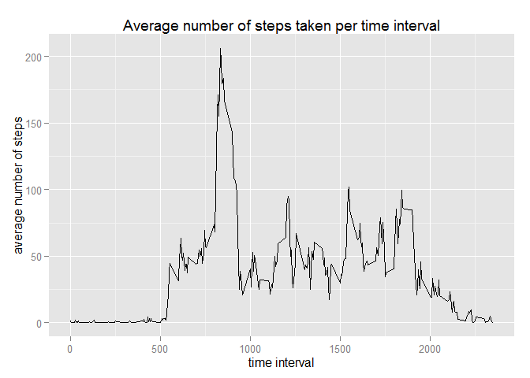
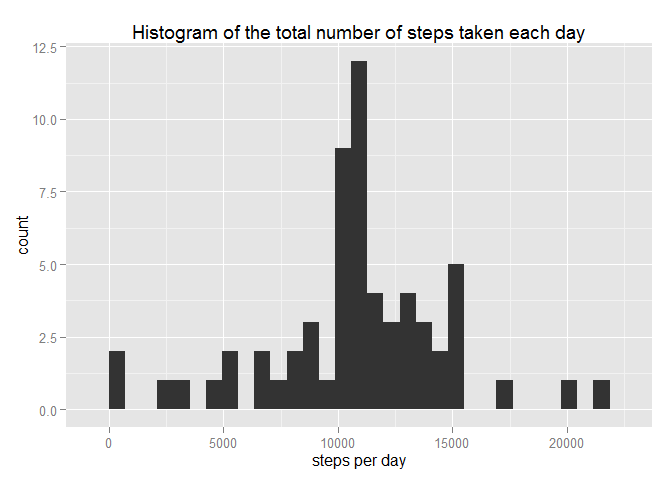
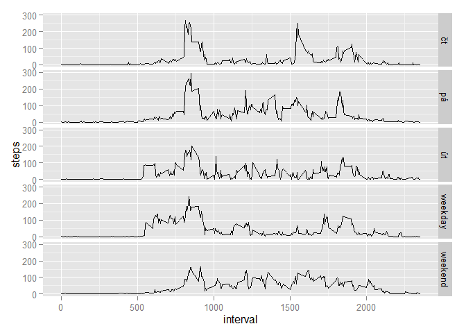

# Reproducible Research: Peer Assessment 1

*Libraries used*

```r
library(dplyr)
library(ggplot2)
```

##Loading and preprocessing the data

Data loaded (imho no further preprocessing is needed)

```r
data <- read.csv("activity.csv", colClasses = c("numeric", "Date", "numeric"))
head(data)
```

```
##   steps       date interval
## 1    NA 2012-10-01        0
## 2    NA 2012-10-01        5
## 3    NA 2012-10-01       10
## 4    NA 2012-10-01       15
## 5    NA 2012-10-01       20
## 6    NA 2012-10-01       25
```

##What is mean total number of steps taken per day?

Total number of steps taken per day calculated (only part of the data is shown)

```r
steps_per_day <- group_by(data, date) %>% summarize(steps = sum(steps, na.rm=TRUE))
head(steps_per_day)
```

```
## Source: local data frame [6 x 2]
## 
##         date steps
## 1 2012-10-01     0
## 2 2012-10-02   126
## 3 2012-10-03 11352
## 4 2012-10-04 12116
## 5 2012-10-05 13294
## 6 2012-10-06 15420
```

Histogram made

```r
qplot(steps_per_day$steps, main = "Histogram of the total number of steps taken each day", xlab = "steps per day")
```

```
## stat_bin: binwidth defaulted to range/30. Use 'binwidth = x' to adjust this.
```

 

Mean and median calculated

```r
mean <- mean(steps_per_day$steps)
median <- median(steps_per_day$steps)
mean
```

```
## [1] 9354.23
```

```r
median
```

```
## [1] 10395
```
The mean of the total number of steps taken per day is 9354.2295082 , the median is 1.0395\times 10^{4}.

##What is the average daily activity pattern?

Plot made

```r
average_steps <- group_by(data, interval) %>% summarize(avrg_steps = mean(steps, na.rm=TRUE))
qplot(average_steps$interval, average_steps$avrg_steps, geom = "line", 
      main = "Average number of steps taken per time interval", 
      xlab = "time interval", ylab = "average number of steps")
```

 

Interval with maximum number of steps calculated

```r
max <- as.numeric(average_steps[average_steps$avrg_steps == max(average_steps$avrg_steps),1])
max
```

```
## [1] 835
```
The interval with maximum number of steps (averaged aross all the days) is 835.

##Imputing missing values

Total number of missing values calculated

```r
NAs <- sum(is.na(data$steps))
NAs
```

```
## [1] 2304
```
Total number of missing values in the dataset is 2304.

New dataset with imputed missing values created. Mean for the relevant 5-minute interval was used.

```r
data_with_avrg <- arrange(merge(data, average_steps, by = 'interval'), date, interval)
data_with_avrg$steps[is.na(data_with_avrg$steps)]=data_with_avrg$avrg_steps[is.na(data_with_avrg$steps)]
noNA_data <- data_with_avrg[,1:3]
head(noNA_data)
```

```
##   interval     steps       date
## 1        0 1.7169811 2012-10-01
## 2        5 0.3396226 2012-10-01
## 3       10 0.1320755 2012-10-01
## 4       15 0.1509434 2012-10-01
## 5       20 0.0754717 2012-10-01
## 6       25 2.0943396 2012-10-01
```

Histogram made and mean and median calculated

```r
noNA_steps_per_day <- group_by(noNA_data, date) %>% summarize(steps = sum(steps, na.rm=TRUE)) 
qplot(noNA_steps_per_day$steps, main = "Histogram of the total number of steps taken each day", xlab = "steps per day")
```

```
## stat_bin: binwidth defaulted to range/30. Use 'binwidth = x' to adjust this.
```

 

```r
noNA_mean <- mean(noNA_steps_per_day$steps)
noNA_median <- median(noNA_steps_per_day$steps)
noNA_mean
```

```
## [1] 10766.19
```

```r
noNA_median
```

```
## [1] 10766.19
```
After the imputation of missing values, the mean of the total number of steps taken per day is 1.0766189\times 10^{4} , the median is 1.0766189\times 10^{4}. They differ from the values calculated for dataset with missing values, they are slightly higher.

##Are there differences in activity patterns between weekdays and weekends?

New factor variable created

```r
noNA_data <- mutate(noNA_data, wd_we=weekdays(noNA_data$date, abbreviate = TRUE))
noNA_data$wd_we <- gsub("(po)|(út)|(st)|(čt)|(pá)", "weekday", noNA_data$wd_we)
noNA_data$wd_we <- gsub("(so)|(ne)", "weekend", noNA_data$wd_we)
noNA_data$wd_we <- as.factor(noNA_data$wd_we)
```

Panel plot made

```r
steps_per_wd_we <- group_by(noNA_data, wd_we, interval) %>% summarize(steps = mean(steps)) 
qplot(interval, steps, data = steps_per_wd_we, geom = "line", facets = wd_we~.)
```

 
